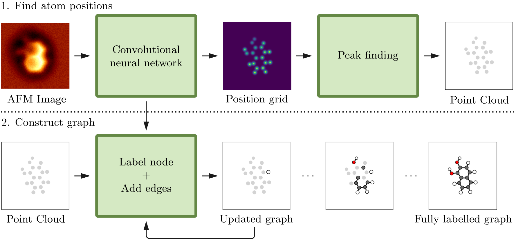

# Graph-AFM
Machine learning molecule graphs from atomic force microscopy images.

(Link to paper when published)

Abstract:
_Despite the success of non-contact atomic force microscopy (AFM) in providing atomic-scale insight into the structure and properties of matter on surfaces, the wider applicability of the technique faces challenges in the difficulty of interpreting the measurement data. We tackle this problem by proposing a machine learning model for extracting molecule graphs of samples from AFM images. The predicted graphs contain not only atoms and their bond connections, but also their coordinates within the image and elemental identification. The model is shown to be effective on simulated AFM images, but we also highlight some issues with robustness that need to be addressed before generalization to real AFM images._



## Setup and usage

This repository contains all the code and data used to achieve the results in the above paper. To run the code, first clone the repository:
```sh
git clone https://github.com/SINGROUP/Graph-AFM.git
cd Graph-AFM
```
Then, the Python environment required for running the code can be installed with Anaconda by using the provided `environment.yml` file:
```sh
conda env create -f environment.yml
```
and the installed environment can be activated with
```sh
conda activate graph-afm
```
The other environment file `environment_exact.yml` contains a dump of the exact list of packages used when training the model presented in the paper. Finally, run the script `build.sh` in the root of the repository to compile C extensions:
```sh
./build.sh
```
\
The model is trained on a dataset of simulated AFM images. The whole database is inconvenient to share directly due to its size, so we instead provide a database of molecule structures that can be used to generate the simulated AFM images. The AFM simulations are done using the [ProbeParticleModel](https://github.com/ProkopHapala/ProbeParticleModel) simulation code from Prokop Hapala. Navigate to the root of this repository and clone the ProbeParticleModel repository there with
```sh
git clone https://github.com/ProkopHapala/ProbeParticleModel.git
cd ProbeParticleModel
git checkout 363709ad3ed191422bfdcafea9ad6135e7906972
```
The database of AFM simulations can then be generated by using the script `generate_data.py` in the `scripts` directory:
```sh
cd scripts
python generate_data.py
```
The script will automatically download the molecule database and generate the simulations into a HDF5 archive file. The complete database takes ~150GB of disk space. The molecule database can also be downloaded directly from https://www.dropbox.com/s/z4113upq82puzht/Molecules_rebias_210611.tar.gz?dl=0.

The model can be trained using the script `train.py`, or `train_distributed.py` for multi-GPU training. Expect this to take a while. Training the model for 50 epochs took roughly 2 days on a system with 4 x Nvidia Tesla V100 32GB GPUs. After the model has been trained, statistics on test set predictions can be run using the script `test.py`.

Pre-trained weights for the model are provided in the directory `pretrained_weights`. See the scripts `predict_examples.py` and `predict_random.py` for examples on how to run predictions with the pre-trained model.
